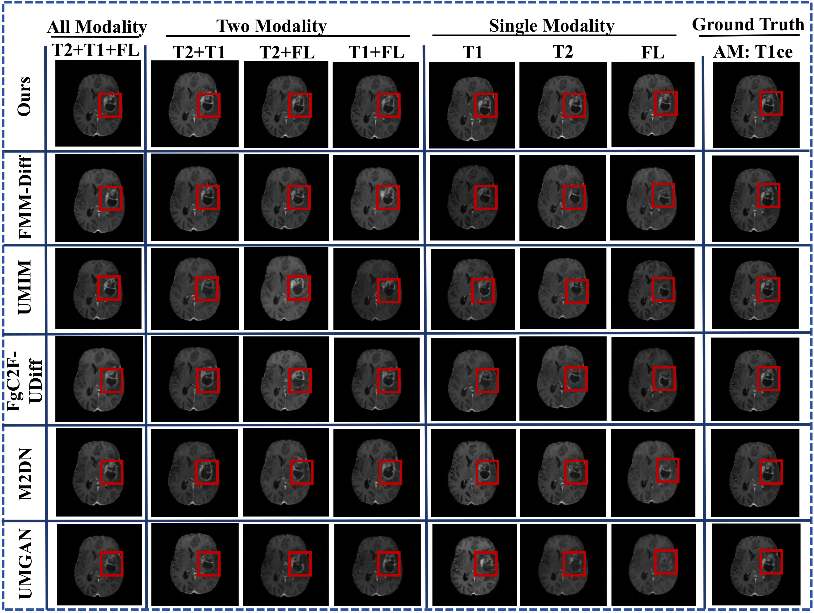

# DFSM-Diff

**DFSM-Diff: A Distilled Feature Mapping and Selective Merging Diffusion Model for MRI Generation with Missing Modality**

DFSM-Diff is a conditional diffusion framework for synthesizing advanced MRI modalities from incomplete routine MRI inputs. It supports arbitrary missing-modality configurations by reconstructing modality-specific latent representations through the Distilled Feature Mapping Module (DFMM) and selectively integrating complementary cross-modal information through the Cross-Modal Selective Merging Module (CSMM).
## 🔧 Configuration

Modify the configuration file at (config.yml) to customize your MRI inputs.

## Overview

<p align="center">
  
</p>

<p align="center">
  <em>
    Overview of the DFSM-Diff framework.
  </em>
</p>

## Generated Results

<p align="center">
  
</p>

<p align="center">
  <em>
    Qualitative MRI synthesis results produced by DFSM-Diff under different
    missing-modality configurations.
  </em>
</p>

```yaml

mri:
  # MRI sequences as input
  modalities_name: ['Flair.nii.gz','T1.nii.gz','T1c.nii.gz','T2.nii.gz' ]
  # number of modality

folder_path:
  data_store_path: "PATH/TO/DATA"

```
Each patient's folder must include all corresponding .nii.gz files.
> 📌 Make sure that the file names match those specified in `modalities_name` in your config file.
```
PATH/TO/DATA/
├── patient1/
│   ├── mri_type1.nii.gz
│   ├── mri_type2.nii.gz
│   └── ...
├── patient2/
│   ├── mri_type1.nii.gz
│   ├── mri_type2.nii.gz
│   └── ...

